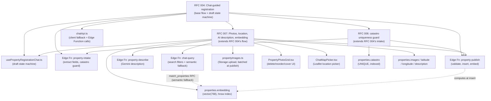

# Workspace Rule: Feature & Module Relationship Graph

Static map of how the shipped RFCs extend each other and which modules/DB columns/Edge Functions
each one touches. Keep this updated whenever a new RFC extends or modifies an existing
chat/registration/search flow — it's the fastest way for a new session to see what depends on what
before changing shared code (`chatApi.ts`, `usePropertyRegistrationChat`, the `properties` table).

