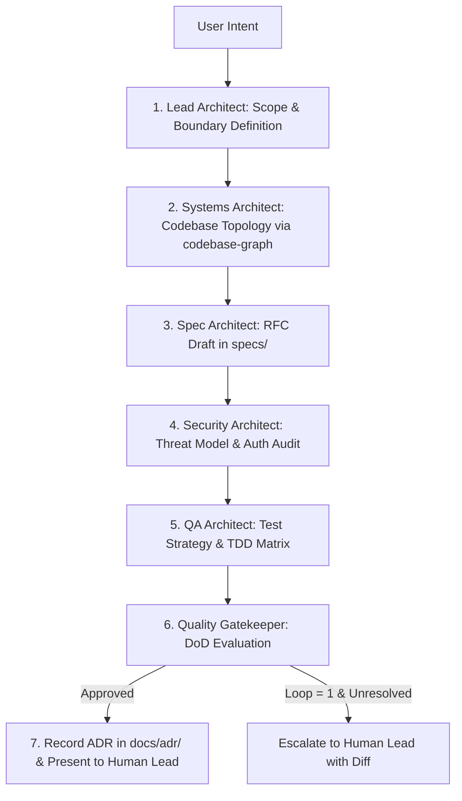

# Architecture Team: LangChain Multi-Agent Squad

This skill orchestrates a multidisciplinary agentic architecture squad using LangChain StateGraph patterns to produce validated, production-grade architectural blueprints and ADRs before any code is written.

## The Squad Roles

1. **Lead Solution Architect (Orchestrator)**: Guides the StateGraph, resolves cross-domain trade-offs, and drives the team to consensus.
2. **Spec & API Architect**: Formulates formal RFCs in `specs/`, defines schema contracts, endpoints, and error states.
3. **Systems & Modularity Architect**: Ingests codebase topology from `codebase-graph`, enforces component boundaries, and applies the Ponytail YAGNI ladder.
4. **Security & Threat Architect**: Conducts STRIDE threat modeling, audits trust boundaries, and validates secret handling.
5. **QA & Verification Architect**: Designs test strategies (unit/integration/e2e) and defines failing assertions for TDD.
6. **Staff Quality Gatekeeper**: Enforces `definition-of-done.md` and validates that all criteria are met before requesting human sign-off.

---

## The Workflow StateGraph

---

## Step-by-Step Execution Protocol

1. **Intake & Scope**:
   - Decompose user goal into: Target Problem, Out of Scope (Non-Goals), and Constraints.
2. **Topology Inspection**:
   - Inspect existing architecture via `.graphify/graph.json` or invoke `codebase-graph`. Identify potential god nodes or tight coupling.
3. **Draft Specification (`specs/XXX-feature.md`)**:
   - Create RFC following `specs/000-spec-template.md`. Include public interfaces, data models, and edge cases.
4. **Security & Threat Model**:
   - Identify trust boundaries, untrusted inputs, and authentication points. Verify against `.agents/references/security-checklist.md`.
5. **QA & Verification Strategy**:
   - Establish testing requirements and formulate the initial failing assertions.
6. **Gatekeeper Review**:
   - Verify that no speculative abstractions were added (Ponytail check).
   - If consensus is reached, generate Architecture Decision Record in `docs/adr/`.
   - Bounded cycle: Maximum 1 revision iteration. Escalate to the human lead if contested.

---

## Anti-Rationalization Table

| Common Agent Excuse | Why It Fails | Mandatory Response |
| :--- | :--- | :--- |
| *"This change is small, we don't need the architecture squad."* | Small changes without boundary checks frequently introduce security leaks or circular dependencies. | If the change touches public interfaces, data schemas, or persistence, run at least the Spec + Security passes. |
| *"We can design the API after we write the code."* | Writing code first creates accidental, brittle APIs that violate Hyrum's Law. | Write the RFC and interface contract in `specs/` first. |
| *"Let's build a flexible plugin system in case we need it later."* | Speculative flexibility adds permanent cognitive debt and maintenance cost. | Apply Ponytail Rung 1: Build strictly for the current requirement. YAGNI. |

---

## Verification & Output
- [ ] Specification created at `specs/XXX-feature.md`.
- [ ] Architecture Decision Record created at `docs/adr/XXXX-title.md`.
- [ ] Unanimous consensus cleared by Quality Gatekeeper.
- [ ] Human lead presented with the architectural blueprint for sign-off.
