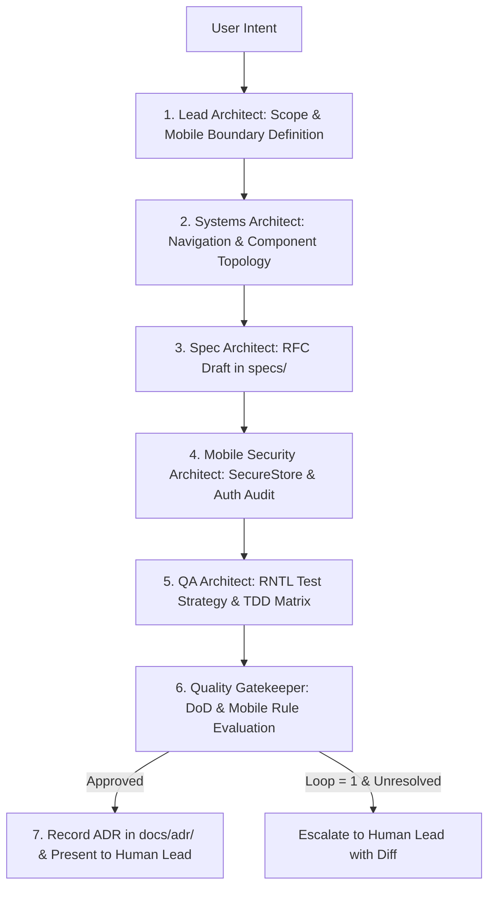

# Mobile Architecture Team: LangChain Multi-Agent Squad

This skill orchestrates a multidisciplinary agentic architecture squad using LangChain StateGraph patterns to produce validated, production-grade mobile architectural blueprints and ADRs for React Native & Expo applications before any code is written.

## The Squad Roles

1. **Lead Mobile Architect (Orchestrator)**: Guides the StateGraph, resolves iOS/Android trade-offs, navigation routing topology, and drives team consensus.
2. **Spec & Mobile API Architect**: Formulates formal RFCs in `specs/`, defines Expo Router layouts, screen states, component props, and API contracts.
3. **Systems & Modularity Architect**: Ingests codebase topology from `codebase-graph`, enforces screen/component/hook boundaries, and applies the Ponytail YAGNI ladder.
4. **Mobile Security Architect**: Audits local storage (`expo-secure-store`), deep linking risk, client bundle secrets, and network TLS boundaries.
5. **Mobile QA & Verification Architect**: Designs test strategies (`@testing-library/react-native`, Jest) and defines failing assertions for TDD.
6. **Staff Quality Gatekeeper**: Enforces `definition-of-done.md` and `06-mobile-development.md` before requesting human sign-off.

---

## The Workflow StateGraph

---

## Step-by-Step Execution Protocol

1. **Intake & Mobile Scope**:
   - Decompose feature into: Target Screen / Component, Platform Support (iOS / Android / Web), and Mobile Performance Targets.
2. **Topology Inspection**:
   - Inspect Expo Router structure in `app/` and shared hooks/components in `src/`. Ensure navigation flows are predictable and avoid unnecessary global states.
3. **Draft Specification (`specs/XXX-feature.md`)**:
   - Create RFC following `specs/000-spec-template.md`. Detail screen states (loading, empty, error, offline), accessibility properties, and typed props.
4. **Security & Threat Model**:
   - Audit data persistence: ensure Sensitive Data $\rightarrow$ `expo-secure-store`, public settings $\rightarrow$ state/AsyncStorage. Validate deep links and client secret isolation.
5. **QA & Verification Strategy**:
   - Define component unit tests (`@testing-library/react-native`) and user interaction assertions before implementation.
6. **Gatekeeper Review**:
   - Verify compliance with `06-mobile-development.md` (touch bounds $\ge 44\text{pt}$, virtualized lists for dynamic data, safe area bounds).
   - Generate Architecture Decision Record in `docs/adr/`.

---

## Anti-Rationalization Table

| Common Agent Excuse | Why It Fails | Mandatory Response |
| :--- | :--- | :--- |
| *"This change is small, we don't need the architecture squad."* | Small component additions without boundary checks frequently break screen layouts or introduce memory leaks. | If touching navigation, global state, or local storage, run at least the Spec + Security passes. |
| *"We can design the component API after writing the screen."* | Writing screens first leads to tightly coupled UI logic that cannot be unit tested easily. | Write the RFC and component interface in `specs/` first. |
| *"Let's add a global state management library just in case."* | Adding heavy Redux/MobX boilerplate when local React state or Context suffices violates YAGNI. | Apply Ponytail Rung 1: Use local state or custom hooks first. YAGNI. |

---

## Verification & Output
- [ ] Specification created at `specs/XXX-feature.md`.
- [ ] Architecture Decision Record created at `docs/adr/XXXX-title.md`.
- [ ] Unanimous consensus cleared by Quality Gatekeeper.
- [ ] Human lead presented with the architectural blueprint for sign-off.
