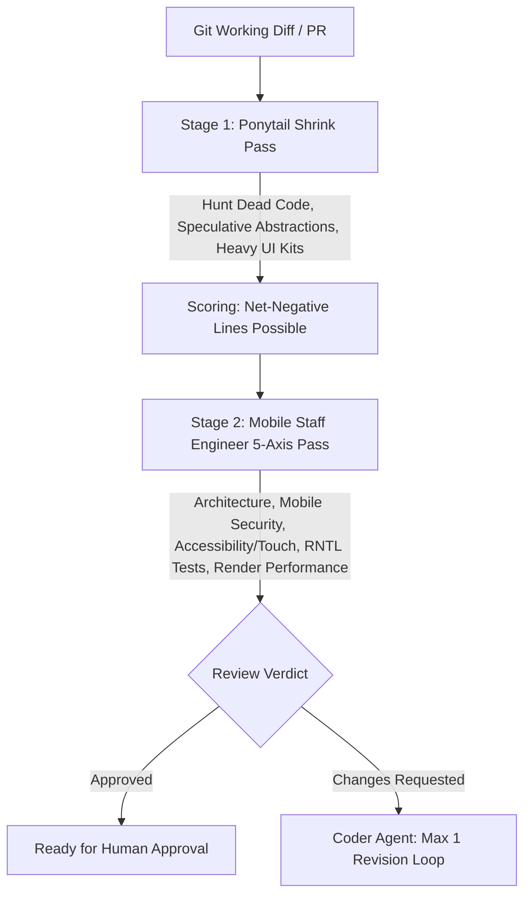

# Mobile Code Review: Two-Stage Quality & Complexity Gate

This skill executes a rigorous two-stage review process for React Native & Expo applications, combining **Ponytail's over-engineering hunter** with a **Mobile Staff Engineer's 5-axis review standard**.

## When to Use
- Before requesting human approval on any pull request or working diff in this mobile repository.
- When running `/review`.
- To audit existing mobile files for re-render leaks, missing accessibility labels, unneeded dependencies, or code bloat.

---

## The Two-Stage Review Process

### Stage 1: The Ponytail Shrink Pass
Hunts complexity exclusively. The goal of this pass is to make the mobile diff **shorter**.
- `delete:` Dead components, unrequested options, unused style blocks.
- `native:` Replaced custom JS helpers with standard React Native primitives (`View`, `Text`, `Pressable`, `StyleSheet`).
- `yagni:` Premature custom context or Redux state where local state / custom hook suffices.
- `shrink:` Same UI/logic in fewer, clearer lines.
- **Metric**: Ends with `net: -N lines possible.` (If lean: *"Lean already. Proceed to Stage 2."*)

### Stage 2: Mobile Staff Engineer 5-Axis Review
Applies the question: *"Would a Senior Mobile Staff Engineer approve this for production on iOS & Android?"*
1. **Architecture & Boundaries**: Follows Expo Router conventions (`app/`), separation of concerns (`src/components/`, `src/hooks/`), file lengths under 300 lines.
2. **Mobile Security**: Storage tiering (SecureStore vs AsyncStorage), zero hardcoded secrets in client JS bundle.
3. **Accessibility & Touch UX**: Minimum 44x44pt touch targets, explicit `accessibilityRole` and `accessibilityLabel` props, dark mode token usage.
4. **Test Quality**: `@testing-library/react-native` tests verify component states (loading, disabled, user press, error).
5. **Render Performance**: No inline render callbacks in `FlatList`, deliberate `React.memo` / `useCallback` usage, Safe Area handling.

---

## Anti-Rationalization Table

| Common Agent Excuse | Why It Fails | Mandatory Response |
| :--- | :--- | :--- |
| *"The screen works in simulator, so code review isn't needed."* | UI code can work in simulator while leaking memory on real devices or crashing on Android. | Run both Stage 1 and Stage 2 passes without exception. |
| *"Accessibility labels can be added later in a cleanup sprint."* | Missing a11y labels fail regulatory standards and create unusable software for screen readers. | Block approval until accessibility props are complete. |

---

## Verification Criteria
- [ ] Stage 1 complexity findings resolved.
- [ ] Stage 2 review checklist cleared across all 5 mobile axes.
- [ ] Structured review output presented with clear approval status.
