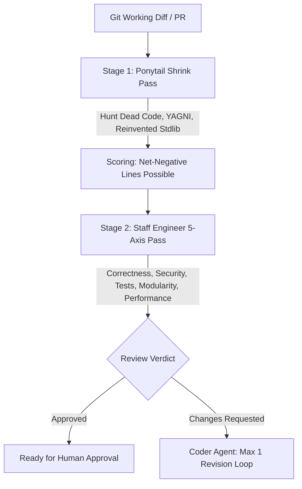

# Code Review: Two-Stage Quality & Complexity Gate

This skill executes a rigorous two-stage review process combining **Ponytail's over-engineering hunter** with a **Senior Staff Engineer's 5-axis review standard**.

## When to Use
- Before requesting human approval on any pull request or working diff.
- When running `/review`.
- To audit existing files for dead code, unneeded dependencies, or complexity bloat.

---

## The Two-Stage Review Process

### Stage 1: The Ponytail Shrink Pass
Hunts complexity exclusively. The goal of this pass is to make the diff **shorter**.
- `delete:` Dead code, speculative flexibility, unrequested options.
- `stdlib:` Hand-rolled logic that standard library already provides.
- `native:` Third-party dependency doing what the runtime platform covers.
- `yagni:` Abstraction with only one implementation or caller.
- `shrink:` Same logic in fewer, clearer lines.
- **Metric**: Ends with `net: -N lines possible.` (If lean: *"Lean already. Proceed to Stage 2."*)

### Stage 2: Staff Engineer 5-Axis Review
Applies the question: *"Would a Senior Staff Engineer approve this for production?"*
1. **Architecture & Boundaries**: Does it respect modularity and file sizing (<300 lines)?
2. **Security**: Are inputs sanitized at boundaries? Zero secrets in code?
3. **Test Quality**: Does it include failing-first unit tests? Are assertions rigorous?
4. **Maintainability & Readability**: Is the code self-documenting with clear naming?
5. **Performance**: Are there obvious N+1 queries, unindexed lookups, or memory leaks?

---

## Anti-Rationalization Table

| Common Agent Excuse | Why It Fails | Mandatory Response |
| :--- | :--- | :--- |
| *"The code works and passes tests, so review is unnecessary."* | Working code can still be an unmaintainable, over-engineered liability. | Run both Stage 1 and Stage 2 passes without exception. |
| *"I'll approve with minor nitpicks and fix them later."* | Nitpicks in AI development accumulate into technical debt. | Resolve complexity issues in the single permitted revision loop. |

---

## Verification Criteria
- [ ] Stage 1 complexity findings resolved or justified.
- [ ] Stage 2 review checklist cleared across all 5 axes.
- [ ] Structured review output presented with clear approval status.
