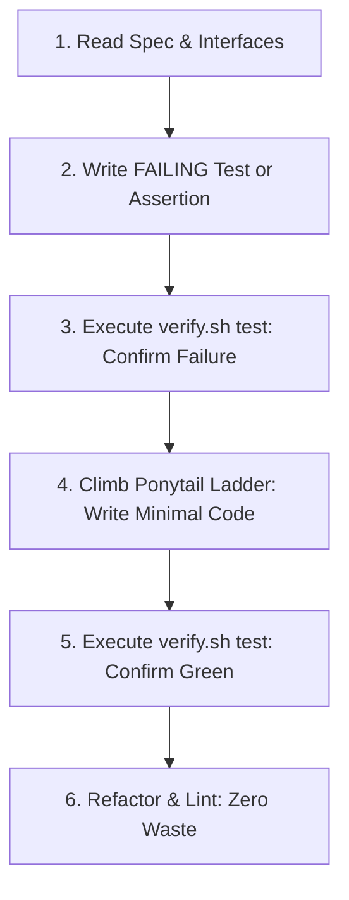

# Minimal Implementation: TDD & The Ponytail Ladder

This skill governs code writing across all programming languages. It combines the rigorous verification of **Test-Driven Development (TDD)** with the uncompromising simplicity of the **Ponytail 7-rung minimalist ladder**.

## When to Use
- Whenever writing, modifying, implementing, or refactoring application code.
- When an agent must write the shortest, cleanest code that satisfies the specification.

---

## The Implementation Lifecycle

### The Ponytail 7-Rung Ladder
Before writing any new function, class, or abstraction, stop at the first rung that holds:

1. **Does this need to exist at all? (YAGNI)** $\rightarrow$ No: Skip it.
2. **Already in this codebase?** $\rightarrow$ Reuse existing helpers, utilities, and patterns. Do not rewrite.
3. **Standard library does it?** $\rightarrow$ Use stdlib (`pathlib`, `itertools`, `Intl`, `fetch`, `net/http`, `std::fs`).
4. **Native platform feature?** $\rightarrow$ Use runtime/OS capabilities before adding libraries.
5. **Installed dependency solves it?** $\rightarrow$ Use it. Do not add redundant dependencies.
6. **Can it be one line?** $\rightarrow$ Make it one line.
7. **Only then**: Write the absolute minimum code that passes the test.

---

## Anti-Rationalization Table

| Common Agent Excuse | Why It Fails | Mandatory Response |
| :--- | :--- | :--- |
| *"I'll write the code first, then add tests once I know it works."* | Writing tests after the fact leads to tests that test what the code *does*, not what it *should do*. | Write the failing assertion or test first. Run `scripts/verify.sh test` to verify it fails. |
| *"Let's build an abstract factory/interface in case we swap implementations."* | Speculative architecture is technical debt. Single implementations do not need interfaces. | Inline it. Add abstraction only when a second real implementation exists. |
| *"I'll import this 5MB library to do one string manipulation."* | Bloats dependency tree, increases attack surface, and slows installs. | Use standard library or native regex. Zero extra dependencies. |

---

## Verification Criteria
- [ ] Failing test existed and failed *before* implementation code was written.
- [ ] Implementation passes `scripts/verify.sh test`.
- [ ] No unrequested dependencies added.
- [ ] Shortest working diff produced.
