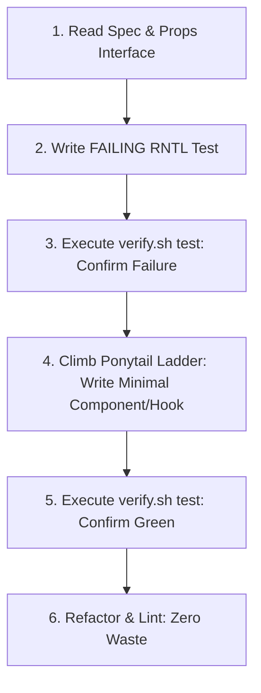

# Mobile Minimal Implementation: TDD & The Ponytail Ladder

This skill governs mobile code writing in React Native & Expo. It combines the rigorous verification of **Test-Driven Development (TDD)** using `@testing-library/react-native` with the uncompromising simplicity of the **Ponytail 7-rung minimalist ladder**.

## When to Use
- Whenever writing, modifying, implementing, or refactoring React Native components, hooks, or Expo screens.
- When an agent must write the shortest, cleanest mobile code that satisfies the specification.

---

## The Mobile Implementation Lifecycle

### The Ponytail 7-Rung Ladder for Mobile
Before writing any new component, hook, or abstraction, stop at the first rung that holds:

1. **Does this need to exist at all? (YAGNI)** $\rightarrow$ No: Skip it.
2. **Already in this codebase?** $\rightarrow$ Reuse existing UI components (`src/components/`), theme tokens (`src/theme/colors.ts`), and custom hooks.
3. **React Native core does it?** $\rightarrow$ Use native primitives (`View`, `Text`, `Pressable`, `FlatList`, `StyleSheet`, `useColorScheme`).
4. **Native Expo API handles it?** $\rightarrow$ Use platform capabilities (`expo-router`, `expo-secure-store`, `expo-status-bar`) before adding external packages.
5. **Installed dependency solves it?** $\rightarrow$ Use existing dependencies. Do not add redundant npm packages.
6. **Can it be one hook or simple function?** $\rightarrow$ Keep it simple and focused.
7. **Only then**: Write the absolute minimum component/hook code that passes the test.

---

## Anti-Rationalization Table

| Common Agent Excuse | Why It Fails | Mandatory Response |
| :--- | :--- | :--- |
| *"I'll write the UI component first, then write tests once I render it in simulator."* | Simulator-only testing misses edge states (loading, disabled, dark mode) and leads to brittle code. | Write the failing `@testing-library/react-native` test first. Confirm failure via `scripts/verify.sh test`. |
| *"Let's build a custom dynamic styling engine wrapper."* | Custom style wrappers add runtime overhead on the JS thread and bloat memory. | Use React Native `StyleSheet.create()` and design tokens. Zero custom style engines. |
| *"I'll import a 10MB UI component kit for one card component."* | Bloats bundle size, slows app startup time, and introduces styling conflicts. | Write a minimal 30-line component using `View`, `Text`, and `Pressable`. |

---

## Verification Criteria
- [ ] Failing component test existed and failed *before* implementation code was written.
- [ ] Implementation passes `scripts/verify.sh test` and `scripts/verify.sh lint`.
- [ ] Accessibility props (`accessibilityRole`, `accessibilityLabel`) set on interactive components.
- [ ] No unrequested dependencies added.
- [ ] Shortest working diff produced.
