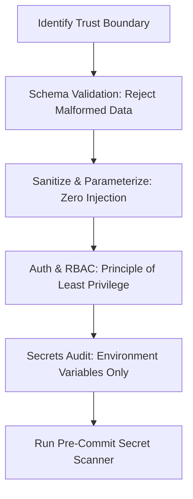

# Security & Hardening: Threat Modeling & Secret Quarantine

This skill provides comprehensive defensive security checks, ensuring code conforms to the principle of least privilege, input validation at trust boundaries, and zero secret leakage.

## When to Use
- When introducing or modifying authentication, authorization, or session handling.
- When creating endpoints that accept untrusted external user input.
- When handling sensitive data (PII, financial, tokens, private keys).
- When running `/security`.

---

## The Security Audit Workflow

### 1. The Three-Tier Boundary System
- **Tier 1 (Outer / Ingestion)**: Strict type and schema validation (Zod, Pydantic, struct unmarshaling). Reject invalid payloads with structured 400 errors.
- **Tier 2 (Domain / Business)**: Enforce authorization rules (RBAC). Verify that the caller has permission to perform this action on this resource.
- **Tier 3 (Data / Persistence)**: Parameterized SQL queries or ORM models. Never concatenate user strings into database queries.

### 2. Secret Quarantine Protocol
- Verify no credentials, API keys, or private certificates exist in code.
- Check that all secret keys are loaded from environment variables.
- Run `scripts/pre-commit-hook.sh` to execute the automated secret scan.

---

## Anti-Rationalization Table

| Common Agent Excuse | Why It Fails | Mandatory Response |
| :--- | :--- | :--- |
| *"This is an internal API, so we don't need strict input validation."* | Internal APIs are vulnerable to SSRF, lateral movement, and unexpected upstream malformed data. | Validate schemas at every system boundary without exception. |
| *"I'll put the API key in .env and hardcode a fallback key just for local dev."* | Fallback keys inevitably leak into version control and production bundles. | Never provide default fallback secrets in source code. |
| *"Parameterized queries are too slow/verbose for this simple query."* | String concatenation in SQL is the #1 cause of catastrophic data breaches. | Always use parameterized queries or prepared statements. |

---

## Verification Criteria
- [ ] Conforms to `.agents/references/security-checklist.md`.
- [ ] Pre-commit hook passes with zero detected secrets.
- [ ] Unit tests verify rejection of malformed or unauthorized inputs.
