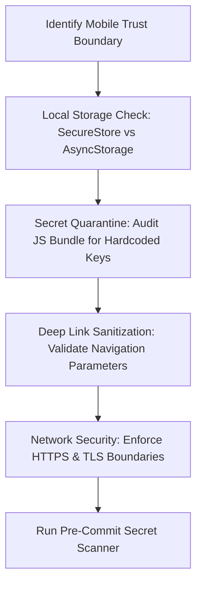

# Mobile Security & Hardening: Threat Modeling & Secret Quarantine

This skill provides comprehensive defensive security checks for React Native and Expo mobile applications, ensuring code conforms to OWASP Mobile Top 10 guidelines, local storage encryption, and zero client bundle secret leakage.

## When to Use
- When introducing or modifying authentication, authorization, or session tokens.
- When saving state locally (auth tokens, user profiles, credentials).
- When configuring deep linking (`app.json` schemes, Expo Router parameters).
- When adding WebViews or external URL handlers.
- When running `/security`.

---

## The Mobile Security Audit Workflow

### 1. Mobile Storage Tiering
- **Encrypted Vault (`expo-secure-store`)**: Required for JWT auth tokens, refresh tokens, PINs, and sensitive user secrets. Uses iOS Keychain & Android Keystore.
- **Unencrypted Cache (`AsyncStorage` / File System)**: Permitted ONLY for public UI state, non-sensitive preferences, or cached non-private content.
- **Prohibited**: Storing raw passwords or master backend keys anywhere on the client.

### 2. Mobile Secret Quarantine Protocol
- React Native JS bundles can be easily extracted and decompiled from application binaries (`.ipa` / `.apk`).
- **Never** put private database credentials, payment secret keys, or admin tokens in client code or `.env` files bundled into client builds.
- Use public client keys (e.g. Supabase anon key, Firebase public config) and route sensitive operations through secure backend API gateways.
- Run `scripts/pre-commit-hook.sh` to execute the automated secret scan.

### 3. Deep Link & WebView Guardrails
- **Deep Link Validation**: Treat parameters in incoming URLs (`hubikmobile://...`) as untrusted user input. Validate and sanitize parameters before navigating or triggering state changes.
- **WebView Isolation**: Disable Javascript interfaces on untrusted WebViews. Enforce strict origin checking.

---

## Anti-Rationalization Table

| Common Agent Excuse | Why It Fails | Mandatory Response |
| :--- | :--- | :--- |
| *"AsyncStorage is fine for JWT tokens during dev, we'll swap later."* | Temporary unencrypted storage routinely slips into production releases. | Use `expo-secure-store` from day one for all auth tokens. |
| *"We can put the API secret in EXPO_PUBLIC_ environment variables."* | `EXPO_PUBLIC_` variables are embedded in plain text into the compiled JS bundle. | Only public keys belong in `EXPO_PUBLIC_`. Private secrets belong on the server. |
| *"Deep links are only called by our own web server, no validation needed."* | Any malicious app on the device can trigger custom scheme deep links. | Validate and sanitize all deep link payloads with strict schemas. |

---

## Verification Criteria
- [ ] Auth tokens stored exclusively in `expo-secure-store`.
- [ ] Zero private secrets in JS bundle or `app.json`.
- [ ] Deep link parameters validated before routing.
- [ ] Pre-commit hook passes with zero detected secrets.
