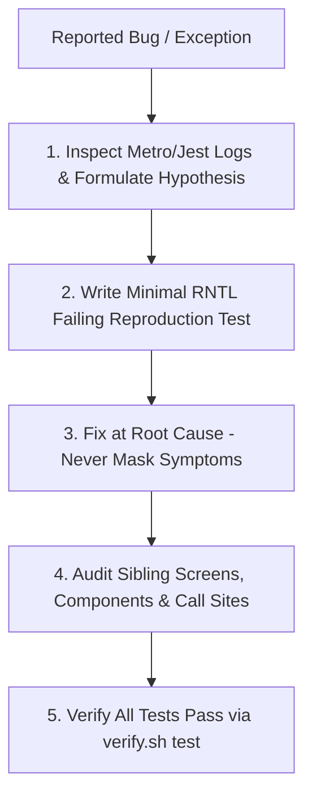

# Mobile Systematic Debugging: Root-Cause Investigation

This skill enforces disciplined investigation over haphazard trial-and-error patching in React Native and Expo applications. It guarantees that mobile bugs are fixed at their true architectural root cause rather than masked at surface symptom points.

## When to Use
- When an automated `@testing-library/react-native` or Jest test fails.
- When an unexpected runtime exception (RedBox, Metro bundler error, unhandled promise rejection) occurs.
- When investigating reported mobile regressions, layout breaks, or state sync bugs.

---

## The 4-Step Mobile Debugging Protocol

### 1. Formulate Hypothesis
- Inspect the full Metro bundler stack trace, component prop types, and hook state transition.
- Formulate an explicit hypothesis: *"Component X fails on Android because screen inset Y is undefined before layout mounts, causing NaN style dimensions."*

### 2. Isolate with Minimal Reproduction Test
- Write the smallest possible `@testing-library/react-native` test or hook assertion reproducing the bug.
- Run `scripts/verify.sh test` to verify that the reproduction test fails with the expected stack trace.

### 3. Root Cause Fix
- Fix the bug where the invalid state originated—not by adding defensive `try/catch` or returning arbitrary default fallback UI that hides broken data.
- Fix underlying hook dependencies, state synchronization, or type mismatch.

### 4. Sibling Caller & Screen Audit
- Grep for all consumers of the modified component or hook across `app/` and `src/components/`.
- Ensure the fix doesn't break sibling screens or platform variants (`.ios.tsx`, `.android.tsx`).

---

## Anti-Rationalization Table

| Common Agent Excuse | Why It Fails | Mandatory Response |
| :--- | :--- | :--- |
| *"Let me just wrap the component render in a try/catch or conditional null return."* | Masks rendering failures, leaving users with silent blank screens and corrupted app state. | Identify why prop/state is invalid and fix the upstream state source. |
| *"I don't need a reproduction test, I'll just tweak the style in index.tsx."* | Without a test, layout regressions will re-emerge during future refactorings. | Write the reproduction test first. |
| *"The test failed, so I'll adjust the test assertion."* | Violates Anti-Test Tampering rule. | Fix the implementation to satisfy the contract. |

---

## Verification Criteria
- [ ] Reproduction test written and confirmed failing first.
- [ ] Code fix applied at root cause.
- [ ] All tests pass via `scripts/verify.sh test`.
- [ ] No regression introduced to sibling screens or components.
