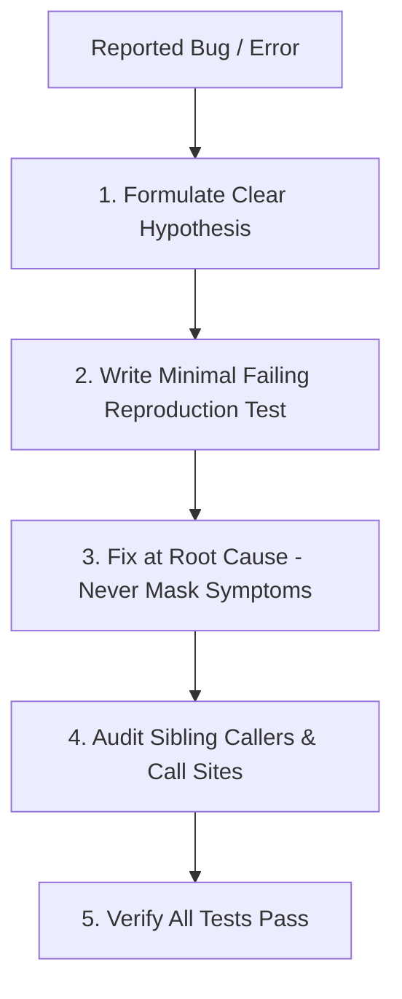

# Systematic Debugging: Root-Cause Investigation

This skill enforces disciplined investigation over haphazard trial-and-error patching. It guarantees that bugs are fixed at their true architectural root cause rather than masked at surface symptom points.

## When to Use
- When an automated test fails.
- When an unexpected runtime exception or error occurs.
- When investigating reported regressions or flaky behavior.

---

## The 4-Step Protocol

### 1. Formulate Hypothesis
- Analyze the error stack trace, inputs, and state.
- Formulate an explicit hypothesis: *"The bug occurs because component X assumes Y, but under condition Z, input is null."*

### 2. Isolate with Minimal Reproduction Test
- Write the smallest possible test or assertion that reproduces the exact failure.
- Run `scripts/verify.sh test` to verify that the reproduction test actually fails.

### 3. Root Cause Fix
- Fix the bug where the invalid state originated—not where it crashed 5 hops later.
- Never wrap a failing call in an empty `try/catch` or return arbitrary nulls to silence a symptom.

### 4. Sibling Caller Audit
- Grep for all callers of the touched function or API.
- Ensure the fix doesn't break sibling consumers and that other callers don't suffer from the same bug.

---

## Anti-Rationalization Table

| Common Agent Excuse | Why It Fails | Mandatory Response |
| :--- | :--- | :--- |
| *"Let me just add an optional chaining `?.` or catch-all block to prevent the crash."* | Masks the bug, hides corrupt state, and causes worse data loss downstream. | Find why the value is unexpected and fix the producer. |
| *"I don't need a reproduction test, I already see the typo."* | Without a test, you cannot prove the fix works or prevent future regressions. | Write the reproduction test first. |
| *"The test failed, so I'll adjust the test assertion."* | Violates the Anti-Test Tampering rule. Creates false greens. | The test defines the contract. Fix the code under test. |

---

## Verification Criteria
- [ ] Reproduction test written and initially failed.
- [ ] Code fix applied at root cause.
- [ ] All tests pass via `scripts/verify.sh test`.
- [ ] No regression introduced to sibling callers.
