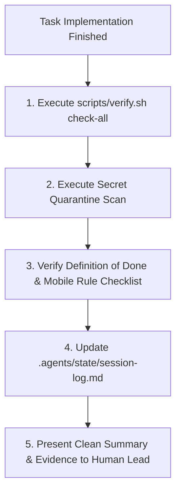

# Mobile Verify & Ship: Pre-Release Gate & Session Handoff

This skill executes the final verification pass for React Native & Expo mobile code before it is handed to the human developer. It enforces the **Prove-It pattern**—requiring raw stdout evidence of type safety, passing unit tests, zero lint warnings, and clean secret quarantine.

## When to Use
- Before declaring any mobile task, component feature, or bug fix complete.
- When running `/verify`.
- At the end of every significant development session.

---

## The Mobile Pre-Release Gate



### 1. Execute Universal Toolchain Contract
Run the comprehensive verification command:
```bash
./scripts/verify.sh check-all
```
This triggers the 4 universal mobile targets:
- `lint`: ESLint (`npm run lint`) exits clean with zero warnings.
- `test`: React Native Testing Library / Jest suite (`npm test`) passes 100%.
- `build`: TypeScript typecheck (`npm run typecheck`) and bundle dry run complete with zero errors.

### 2. Secret Quarantine Scan
Verify that no credentials, tokens, or untracked scratchpads are staged:
```bash
./scripts/pre-commit-hook.sh
```

### 3. Record Session Handoff
Append the completion entry to `.agents/state/session-log.md` with commit details, test results, and next actions.

---

## Anti-Rationalization Table

| Common Agent Excuse | Why It Fails | Mandatory Response |
| :--- | :--- | :--- |
| *"The code looks correct, so I don't need to run verify.sh."* | "Looks right" is not evidence. Unrun React Native code has missing prop types, type errors, or broken imports. | Run `scripts/verify.sh check-all` and inspect raw output. |
| *"TypeScript type errors are minor, I can ignore them."* | TypeScript errors in React Native lead to runtime undefined crashes on native devices. | Zero TypeScript errors tolerated (`tsc --noEmit`). |
| *"I'll leave my test scratch component in root for reference."* | Clutters the repo and breaks Expo Router file discovery. | Delete all temporary scratch files immediately. |

---

## Verification Criteria
- [ ] `./scripts/verify.sh check-all` exited with code 0.
- [ ] Pre-commit secret scan passed.
- [ ] `.agents/state/session-log.md` updated.
- [ ] Git working tree clean.
