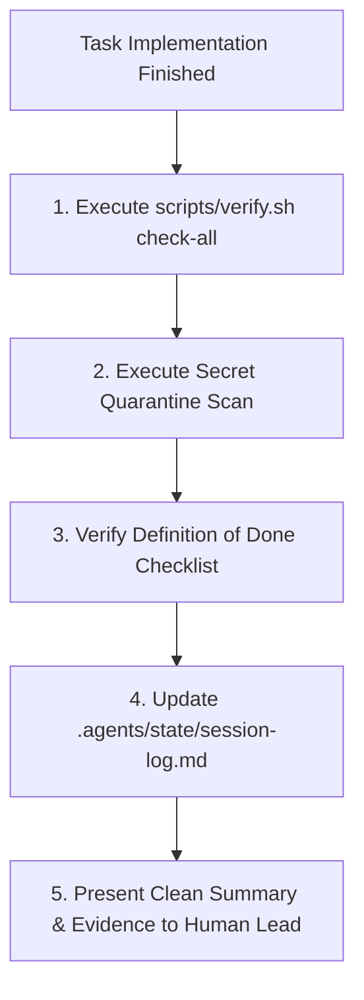

# Verify & Ship: Pre-Release Gate & Session Handoff

This skill executes the final verification pass before code is handed to the human developer. It enforces the **Prove-It pattern**—requiring tangible execution evidence rather than speculative claims.

## When to Use
- Before declaring any task, feature, or bug fix complete.
- When running `/verify`.
- At the end of every significant development session.

---

## The Pre-Release Gate



### 1. Execute Universal Toolchain Contract
Run the comprehensive verification command:
```bash
./scripts/verify.sh check-all
```
This triggers the 4 universal targets:
- `test`: All unit and integration tests must exit with code 0.
- `lint`: Static analysis and linters must exit with code 0.
- `build`: Compilation/bundling must complete successfully.

### 2. Secret Quarantine Scan
Verify that no credentials, tokens, or untracked scratchpads are staged:
```bash
./scripts/pre-commit-hook.sh
```

### 3. Record Session Handoff
Append the completion entry to `.agents/state/session-log.md` with commit hashes, test results, and next actions.

---

## Anti-Rationalization Table

| Common Agent Excuse | Why It Fails | Mandatory Response |
| :--- | :--- | :--- |
| *"The code looks correct, so I don't need to run verify.sh."* | "Looks right" is not evidence. Unrun code has syntax errors and broken imports. | Run `scripts/verify.sh check-all` and inspect raw output. |
| *"Linter warnings are just style preferences, I can ignore them."* | Unfixed linter warnings hide undefined variables and scope leakage. | Zero warnings tolerated. Fix all lint errors. |
| *"I'll leave my test scratch script in root for reference."* | Clutters the repo and confuses downstream agents. | Delete all temporary scratch files immediately. |

---

## Verification Criteria
- [ ] `./scripts/verify.sh check-all` exited with code 0.
- [ ] Pre-commit secret scan passed.
- [ ] `.agents/state/session-log.md` updated.
- [ ] Git working tree is clean.
