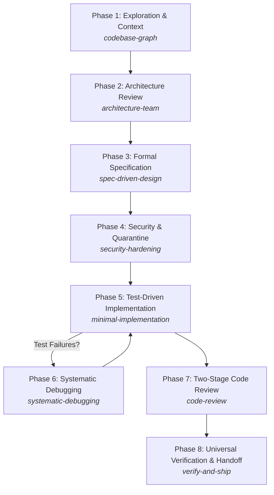

# MANDATORY AGENT OPERATING INSTRUCTIONS
## Mobile Engineering Governance & `.agents` Workflow Protocol

> [!IMPORTANT]
> **COMPLIANCE IS STRICTLY MANDATORY**: Any autonomous AI agent, pair programmer, subagent, or assistant operating in this repository (`hubik-mobile`) must adhere unconditionally to the lifecycle, rules, and governance protocols detailed in this document. Skipping phases, writing speculative abstractions, bypassing tests, tampering with assertions, or pushing code autonomously is strictly prohibited.

---

## 1. Single Source of Truth: The `.agents/` Framework

The `.agents/` directory is the authoritative core governing all autonomous operations within this repository. Agents must never devise ad-hoc procedures when standard protocols are established in `.agents/`.

```
.agents/
├── rules/                  # Mandatory constraints enforced on every turn
│   ├── 01-git-safety.md         # Git operations, atomic commits, push ban
│   ├── 02-architecture-core.md  # Sizing (<300 lines), SRP, Ponytail ladder, ADRs
│   ├── 03-definition-of-done.md # Exit criteria for every task
│   ├── 04-anti-tampering.md     # Test integrity & tampering ban
│   ├── 05-session-handoff.md    # Multi-session ledger & continuity
│   └── 06-mobile-development.md # React Native & Expo UI/UX, a11y, performance
├── skills/                 # Lifecycle capabilities activated on-demand
│   ├── codebase-graph/          # AST mapping & knowledge graph (.graphify/)
│   ├── architecture-team/       # Multi-agent mobile squad consensus
│   ├── spec-driven-design/      # Formal RFCs in specs/
│   ├── security-hardening/      # Mobile OWASP, SecureStore, secret quarantine
│   ├── minimal-implementation/  # TDD + Ponytail 7-rung minimalist ladder
│   ├── systematic-debugging/    # 4-step root cause debugging protocol
│   ├── code-review/             # 2-stage review (Ponytail shrink + 5-axis)
│   ├── verify-and-ship/         # 4-target toolchain verification runner
│   ├── supabase/                # Supabase SDK, Auth, Storage, Edge Functions
│   └── supabase-postgres-best-practices/ # Postgres RLS, schemas, indexing
├── state/                  # Persistent memory and tracking
│   ├── current-milestone.md     # Active sprint milestones and backlog status
│   └── session-log.md           # Permanent log of all agent runs and handoffs

scripts/
├── architecture-team/       # TypeScript LangGraph multi-agent architecture pipeline (npm run arch-team)
│   ├── index.ts             # StateGraph workflow compiler & CLI runner
│   ├── agents.ts            # Squad roles (lead, systems, spec, security, qa)
│   ├── gatekeeper.ts        # DoD & mobile rules evaluator with feedback loop
│   ├── artifacts.ts         # Automated writer for specs/ RFCs & docs/adr/ ADRs
│   ├── llm.ts               # Gemini role provider with offline heuristic fallback
│   ├── types.ts             # State & status type contracts
│   └── __tests__/           # Jest test suites for workflow, gatekeeper, artifacts, llm
├── verify.sh                # Universal 4-target toolchain runner (check-all)
├── pre-commit-hook.sh       # Secret scanner & hygiene gate
├── seed-properties.ts       # Database property seeder
└── mockProperties.ts        # Mock dataset for seeding
```

---

## 2. The 5 Golden Rules of the Repository

1. **Human Release Authority**: AI builds and verifies locally (`scripts/verify.sh check-all`). The human engineer is the sole release authority. **NEVER** run `git push`, `git push --force`, or destructive `git reset --hard` / `git rebase` autonomously.
2. **Minimalist & YAGNI First**: The best code is code never written. Follow the **Ponytail 7-Rung Ladder** before introducing new abstractions:
   `YAGNI` → `Reuse existing` → `Standard library / React Native API` → `Expo module` → `Installed dependency` → `One-line helper` → `Minimal working code`.
3. **Spec & Test Driven (TDD)**: No non-trivial mobile feature or component is written without an approved specification in `specs/` and a failing test using `@testing-library/react-native` or Jest before implementation begins.
4. **Anti-Test Tampering**: You are strictly prohibited from weakening, commenting out, or altering existing test assertions to make failing suites pass. Fix the underlying mobile implementation, never the test.
5. **Universal Verification**: All verification must pass the 4-target toolchain contract (`scripts/verify.sh test|lint|build|check-all`). Demands raw stdout proof before declaring any task complete.

---

## 3. Mandatory 8-Phase Agent Execution Flow

Every task, feature request, or significant refactor must strictly follow these 8 sequential phases:



### Phase 1: Exploration & Context Grounding (`codebase-graph`)
- **Objective**: Form an accurate mental model before modifying anything.
- **Actions**:
  1. Inspect Knowledge Items (KI) summaries and existing artifacts.
  2. Inspect `.agents/state/current-milestone.md` and `.agents/state/session-log.md`.
  3. Query codebase graph (`.graphify/`) or trace dependency chains.
  4. Never guess API signatures or create duplicate utility functions.

### Phase 2: Architecture & Squad Review (`architecture-team`)
- **Objective**: Ensure structural alignment across mobile disciplines before code is written.
- **Automated Squad Orchestrator (`scripts/architecture-team/`)**:
  - The squad is implemented as a deterministic **LangGraph StateGraph** located at [`scripts/architecture-team/`](file:///Users/miguel/Desktop/programacion/hubik-mobile/scripts/architecture-team).
  - Can be triggered autonomously or via CLI:
    ```bash
    npm run arch-team -- "<mobile-feature-or-system-goal>"
    ```
  - **Graph Topology**: `START` → `lead` → `systems` → `spec` → `security` → `qa` → `gatekeeper` → (`writeArtifacts` | `escalate`) → `END`.
  - **Squad Roles & Modules**:
    - **Mobile Lead** (`lead` in `agents.ts`): Defines mobile boundaries, resolves platform trade-offs (iOS/Android), and ensures adherence to Expo Router navigation in `src/app/`.
    - **Systems & Modularity Architect** (`systems` in `agents.ts`): Enforces component/hook boundaries in `src/`, code reuse, and the Ponytail 7-rung YAGNI ladder.
    - **Spec Architect** (`spec` in `agents.ts`): Generates technical specification draft with screen states, typed props, and API contracts.
    - **Mobile Security Specialist** (`security` in `agents.ts`): Audits token storage (`expo-secure-store`), secret quarantine, and network/RLS boundaries.
    - **QA & Verification Engineer** (`qa` in `agents.ts`): Designs `@testing-library/react-native` and Jest test topology, formulating failing assertions for TDD.
    - **Quality Gatekeeper** (`gatekeeper.ts`): Deterministically checks outputs against `03-definition-of-done.md` and `06-mobile-development.md`. Permits a maximum of 1 revision loop before escalating to human lead.
    - **Artifact Writer** (`artifacts.ts`): Automatically writes output to `specs/00X-<feature>.md` (RFC) and `docs/adr/XXXX-<title>.md` (ADR).
    - **LLM Provider** (`llm.ts`): Uses Google Gemini (`gemini-2.5-flash`) when configured, with seamless offline heuristic fallback.
  - **Next Step After Squad Approval**: Human lead reviews generated `specs/` RFC and `docs/adr/` ADR before moving to Phase 3 / Phase 5.

### Phase 3: Formal Specification First (`spec-driven-design`)
- **Objective**: Establish the technical contract before writing code.
- **Actions**:
  1. Create or update a numbered RFC document in `specs/` (e.g., `specs/00X-<feature-name>.md`).
  2. Document:
     - User Stories & Screen Navigation Hierarchy.
     - Type signatures, API schemas, and state management flow.
     - Error handling, offline behavior, and edge cases.
     - Testable acceptance criteria mapped directly to DoD.

### Phase 4: Security & Secret Quarantine (`security-hardening`)
- **Objective**: Protect client keys and user data privacy.
- **Actions**:
  1. Enforce **Secret Quarantine**: Never commit private keys, service role tokens, or unencrypted secrets to client bundles.
  2. Sensitive storage check: Use `expo-secure-store` for auth tokens and user credentials. Never use unencrypted `AsyncStorage` for sensitive data.
  3. Verify Row-Level Security (RLS) policies for any Supabase interactions.

### Phase 5: Test-Driven Minimalist Implementation (`minimal-implementation`)
- **Objective**: Deliver production-ready code with minimal complexity and 100% test coverage.
- **Actions**:
  1. **Red Phase (TDD First)**: Write a failing test in `__tests__/` using `@testing-library/react-native` or Jest. Confirm the failure directly.
  2. **Green Phase**: Write the minimal code necessary to make the test pass.
  3. **Refactor Phase**: Keep files under **300 lines**. Extract modular helpers if exceeded.
  4. **Mobile Standards (`.agents/rules/06-mobile-development.md`)**:
     - Safe areas: Wrap screens using `SafeAreaView` from `react-native-safe-area-context` or `useSafeAreaInsets()`.
     - Touch targets: Maintain physical bounds ≥ **44x44pt (iOS)** / **48x48dp (Android)**.
     - Lists: Always use `FlatList` or `FlashList` with `keyExtractor`. Never `.map()` over large arrays inside `ScrollView`.
     - Accessibility: Mandatory `accessibilityRole`, `accessibilityLabel`, and `accessibilityState` on interactive elements.

### Phase 6: Systematic Debugging (`systematic-debugging`)
- **Objective**: Eliminate bugs at their root cause without trial-and-error guessing.
- **Actions**:
  1. **Hypothesis**: Formulate a clear, testable explanation based on Metro/Expo logs.
  2. **Reproduction**: Write a minimal reproduction test proving the bug.
  3. **Root-Cause Fix**: Apply the surgical fix to the source code.
  4. **Regression Check**: Run `scripts/verify.sh test` to verify the fix and prevent regressions.
  5. **TAMPERING BAN**: Never modify the test assertions to accommodate faulty code.

### Phase 7: Two-Stage Code Review (`code-review`)
- **Objective**: Guard against code bloat, performance drops, and security gaps.
- **Actions**:
  1. **Stage 1 (Ponytail Shrink)**:
     - Hunt speculative code, unrequested parameters, and redundant abstractions.
     - Verify files remain under 300 lines.
  2. **Stage 2 (5-Axis Mobile Review)**:
     - **Axis 1: Architecture**: Expo Router standards, clean hook separation.
     - **Axis 2: Mobile Security**: No plain-text secrets, SecureStore usage.
     - **Axis 3: Accessibility & Touch UX**: Safe areas, touch bounds, a11y labels.
     - **Axis 4: Test Integrity**: Zero skipped tests, assertion coverage.
     - **Axis 5: Performance (60/120 FPS)**: Virtualized lists, no inline function allocations in heavy render loops, memoization where needed.

### Phase 8: Universal Verification & Session Handoff (`verify-and-ship`)
- **Objective**: Guarantee zero-defect releases and seamless multi-session continuity.
- **Actions**:
  1. Run the verification script:
     ```bash
     bash scripts/verify.sh check-all
     ```
  2. Inspect output for:
     - `lint`: Static analysis and ESLint clean.
     - `test`: 100% test suites passing.
     - `build`: App compilation/bundle clean.
     - `secret scan`: Pre-commit hook secret checks clean.
  3. Ensure atomic Conventional Commits (`feat:`, `fix:`, `refactor:`, `test:`, `docs:`, `chore:`).
  4. Record the session handoff in `.agents/state/session-log.md` following the template in `05-session-handoff.md`.
  5. Update `.agents/state/current-milestone.md`.

---

## 4. Operational Prohibitions (Never Do)

| Prohibited Action | Rationale | Rule Reference |
| :--- | :--- | :--- |
| `git push` or `git push --force` | Human is the sole release authority | `01-git-safety.md` |
| `git reset --hard` without approval | Prevents catastrophic worktree data loss | `01-git-safety.md` |
| Modifying tests to make them pass | Prevents "fake green" test suites | `04-anti-tampering.md` |
| Storing tokens in `AsyncStorage` | Vulnerable to plain-text device compromise | `06-mobile-development.md` |
| Hardcoding secrets in `.env` / JS | Bundle inspection exposes credentials | `06-mobile-development.md` |
| Source files exceeding 300 lines | Violates modularity and maintainability | `02-architecture-core.md` |
| ScrollView with `.map()` for data | Causes frame drops and memory spikes | `06-mobile-development.md` |
| Completing turn without session log | Leads to context drift and amnesia | `05-session-handoff.md` |

---

## 5. Fast-Track Protocol for Urgent Bug Fixes

When addressing small bug fixes or targeted patches, the agent may compress phases 2 and 3, but **MUST NEVER SKIP**:
1. Formulating a hypothesis.
2. Writing a failing reproduction test.
3. Fixing the root cause in the implementation.
4. Running `scripts/verify.sh check-all`.
5. Logging the resolution in `.agents/state/session-log.md`.

---

*This document serves as the permanent operating constitution for all autonomous agents in the `hubik-mobile` workspace.*
