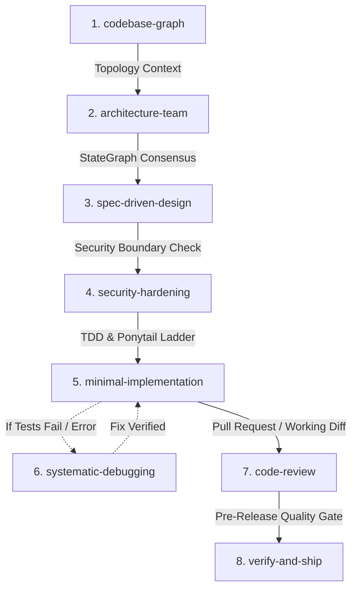

# The Unified Agentic Architecture Suite Guide

This guide details the **8 non-overlapping lifecycle skills** created by synthesizing Addy Osmani's `agent-skills`, Superpowers, Ponytail, Graphify, and the LangChain Architecture Team.

---

## The 8 Non-Overlapping Skills

### 1. `codebase-graph`
- **When to Use**: Exploration, mapping architecture, understanding relationships across files.
- **Key Command**: `/graphify`, `/graphify query "<question>"`.
- **Under the Hood**: Tree-sitter AST extraction + persistent graph in `.graphify/graph.json`.

### 2. `architecture-team`
- **When to Use**: Large architectural refactors, subsystem design, cross-domain consensus.
- **Key Command**: `/arch-team [goal]`.
- **Under the Hood**: LangChain StateGraph orchestrating 6 specialist roles (Lead, Spec, Systems, Security, QA, Gatekeeper).

### 3. `spec-driven-design`
- **When to Use**: Drafting RFCs in `specs/`, defining API contracts and schemas before coding.
- **Key Command**: `/spec [feature-name]`.
- **Under the Hood**: Superpowers brainstorming + Addy Osmani specification format + Hyrum's Law.

### 4. `security-hardening`
- **When to Use**: Modifying auth, processing user input, handling tokens or sensitive data.
- **Key Command**: `/security`.
- **Under the Hood**: STRIDE threat modeling, OWASP Top 10, automated secret scanning.

### 5. `minimal-implementation`
- **When to Use**: Writing, implementing, or refactoring application code.
- **Key Command**: Implementing any task.
- **Under the Hood**: Superpowers TDD (write failing test first) + Ponytail 7-rung minimalist ladder (YAGNI, stdlib first).

### 6. `systematic-debugging`
- **When to Use**: Troubleshooting exceptions, failing tests, or unexpected regressions.
- **Key Command**: Debugging tasks.
- **Under the Hood**: Hypothesis $\rightarrow$ minimal reproduction test $\rightarrow$ root cause fix $\rightarrow$ caller audit.

### 7. `code-review`
- **When to Use**: Reviewing diffs before human sign-off or PR creation.
- **Key Command**: `/review`.
- **Under the Hood**: Stage 1 (Ponytail complexity shrink) $\rightarrow$ Stage 2 (Staff Engineer 5-axis review).

### 8. `verify-and-ship`
- **When to Use**: Final verification gate and session handoff.
- **Key Command**: `/verify`.
- **Under the Hood**: Definition of Done + Prove-It evidence runner (`scripts/verify.sh`) + session handoff ledger.
