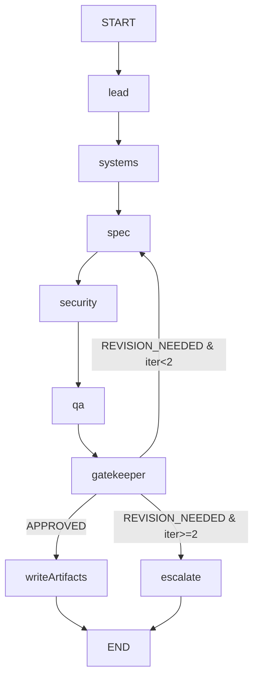

# RFC 003: LangGraph Multi-Agent Architecture Team Orchestrator

- **Author**: AI Agent (Mobile Engineering)
- **Status**: Approved
- **Created**: 2026-09-15
- **Target Release / Milestone**: Agent Governance Tooling
- **Related Skill**: `.agents/skills/architecture-team/SKILL.md`

---

## 1. Problem Statement & Motivation

The repository documents a LangChain-powered Architecture Squad in `.agents/skills/architecture-team/SKILL.md`, but the only executable implementation is a **Python demo** (`scripts/architecture-team/run.py`) that prints titles without invoking a real StateGraph, LLM, or producing governance artifacts. The repo itself is 100% JavaScript/TypeScript (Expo + Express + `@google/genai`). The demo cannot run inside the existing toolchain, produces no `specs/` or ADR output, and does not implement the orchestration constraints (bounded iteration loop, structured handoff, deterministic gatekeeper).

**Goal**: Replace the Python demo with a production-grade LangGraph StateGraph in TypeScript that implements the Architecture Team skill end-to-end: multi-role LLM agents (Gemini) with an offline deterministic fallback, a deterministic Quality Gatekeeper enforcing Definition of Done, bounded revision loop (max 1 iteration), and on-approval generation of `specs/` and `docs/adr/` artifacts.

---

## 2. Goals & Explicit Non-Goals

### Goals
- [x] Replace `scripts/architecture-team/run.py` with a typed TypeScript LangGraph StateGraph (`@langchain/langgraph`).
- [x] Implement nodes: `lead`, `systems`, `spec`, `security`, `qa`, `gatekeeper`, `writeArtifacts`.
- [x] Each role node calls Gemini (`gemini-2.5-flash`) with a role-specific system prompt; deterministic fallback when `GEMINI_API_KEY` is absent or the call fails.
- [x] Gatekeeper is **deterministic** and validates DoD conditions before approving.
- [x] Enforce the bounded iteration protocol: max **1 revision loop**, then escalation to the human lead.
- [x] On approval, write `specs/<XXX>-<feature>.md` and `docs/adr/<XXXX>-title.md` to disk.
- [x] CLI exposed as `npm run arch-team -- "<mobile-feature-or-system-goal>"`.
- [x] Full Jest test coverage for the gatekeeper, artifacts writer, LLM client (mocked), and end-to-end workflow with the fallback path.

### Non-Goals (Out of Scope)
- No autonomous `git add` / `git commit` / `git push` of generated artifacts.
- No execution of security checks against real infrastructure — the security agent produces findings text for human review.
- No persistence of the graph state (checkpointing/langgraph memory) — state is in-memory per invocation.
- No UI / mobile screens changes; this is backend tooling only.

---

## 3. User Stories & Acceptance Criteria

- **Story 1 (Nominal Flow)**:
  - **Given** the CLI is invoked with `npm run arch-team -- "auth pipeline"` and `GEMINI_API_KEY` is set
  - **When** the graph executes
  - **Then** each role node returns structured content, the gatekeeper approves, and `specs/` + `docs/adr/` files are written
  - **And** the process prints a trace of each node visit and exits with code 0.

- **Story 2 (Gap in DoD)**:
  - **Given** a role node returns empty/void content (e.g. spec draft missing)
  - **When** the gatekeeper evaluates the state
  - **Then** the graph takes the `revision` edge back to a role node, incrementing `iteration`
  - **And** on the second consecutive failure the graph takes the `escalate` edge and terminates with status `ESCALATED`.

- **Story 3 (Offline / No API Key)**:
  - **Given** no `GEMINI_API_KEY` is configured
  - **When** the graph runs
  - **Then** every role node uses the deterministic fallback provider and the graph still terminates with a defined status.

---

## 4. Proposed Architecture & Public Contracts

### StateSchema (LangGraph `Annotation<ArchitectureState>`)

```typescript
interface ArchitectureState {
  intent: string;
  topologyNotes: string;
  specDraft: string;
  securityFindings: string;
  qaPlan: string;
  systemsApproved: boolean;
  securityApproved: boolean;
  gatekeeperStatus: 'PENDING' | 'APPROVED' | 'REVISION_NEEDED' | 'ESCALATED';
  iteration: number;
  feedback: string[];
  specPath: string;
  adrPath: string;
}
```

### Graph Topology



### Public Contract

- **CLI**: `npm run arch-team -- "<intent>"`
  - Exit codes: `0` approved/actioned, `2` escalated (revision loop exhausted), `1` runtime error.
- **Module exports** (`scripts/architecture-team/index.ts`):
  - `compileGraph(): CompiledStateGraph` — builds the graph from nodes/edges.
  - `runArchitecturePipeline(intent: string, options?): Promise<ArchitectureState>` — convenience runner used by CLI and tests.
- **Artifact naming**:
  - `specs/<NextSeq>-<kebab-title>.md` derived from intent, padded to 3 digits.
  - `docs/adr/<NextSeq>-<kebab-title>.md` derived from intent, padded to 4 digits.
  - Sequence numbers computed by scanning existing files; no fixed constants.

### Data Models & State Changes
- State is additive (LangGraph `Annotated.reduce`); each node writes its own slice and appends to `feedback`.
- No database or config file changes.

---

## 5. Security & Error Handling

### Trust Boundaries & Sanitization
- CLI intent is untrusted input: normalized (trim), length-capped, and ASCII-kebab-cased before being used to derive file paths (block path traversal / command injection).
- LLM raw text may be injected in artifact names: sanitized before writing.

### Failure Modes & Status Codes

| Failure Condition | Handling Strategy | Return / Exit |
| :--- | :--- | :--- |
| `GEMINI_API_KEY` absent | Deterministic fallback provider per role | Normal flow continues |
| Gemini call throws/timeouts | `try/catch` → fallback provider + `feedback` entry | Status preserved |
| DoD gap on first pass | `revision` edge → re-run affected scope | iteration = 1 |
| DoD gap on second pass | `escalate` edge → terminal `ESCALATED` | Exit code 2 |
| Malformed intent (empty, `..`, long) | Sanitizer returns placeholder + feedback | Normal flow continues |
| Artifact write EACCES/ENOENT | `console.error` + process exit 1 | Exit 1 |

---

## 6. Verification & Test Plan

- [ ] `gatekeeper.test.ts`: pure action selector — `approve`, `revision` (iter<2), `escalate` (iter>=2).
- [ ] `artifacts.test.ts`: writes spec + ADR to a Jest `tmpdir`; asserts naming, sequencing from scan, and path sanitization (no traversal).
- [ ] `llm.test.ts`: mocked `GoogleGenAI` returns per-role content; unauthorized/error path falls back and returns deterministic text.
- [ ] `workflow.test.ts`: `runArchitecturePipeline` via `compileGraph()` with fallback provider; asserts node trace (`visited`), final `gatekeeperStatus === 'APPROVED'`, and `specPath`/`adrPath` set. Second test drives the escalation path by injecting a stub LLM provider whose `spec` role returns empty content (injection seam in the contract, no test tampering) and asserts `ESCALATED` after exhausting the loop.
- [ ] Gate: `scripts/verify.sh check-all` (lint, Jest, `tsc --noEmit`, pre-commit secret scan) exits 0.